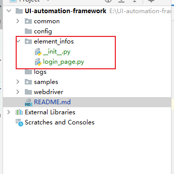
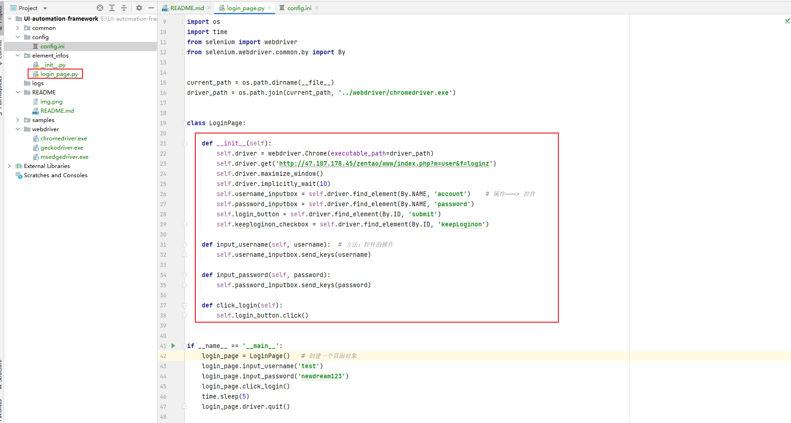
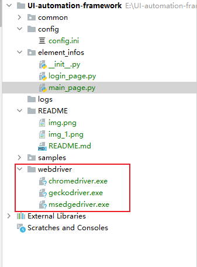
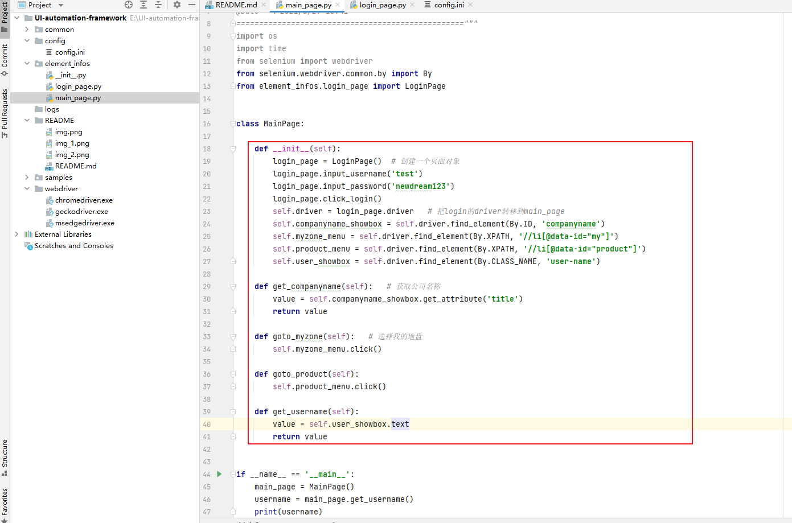
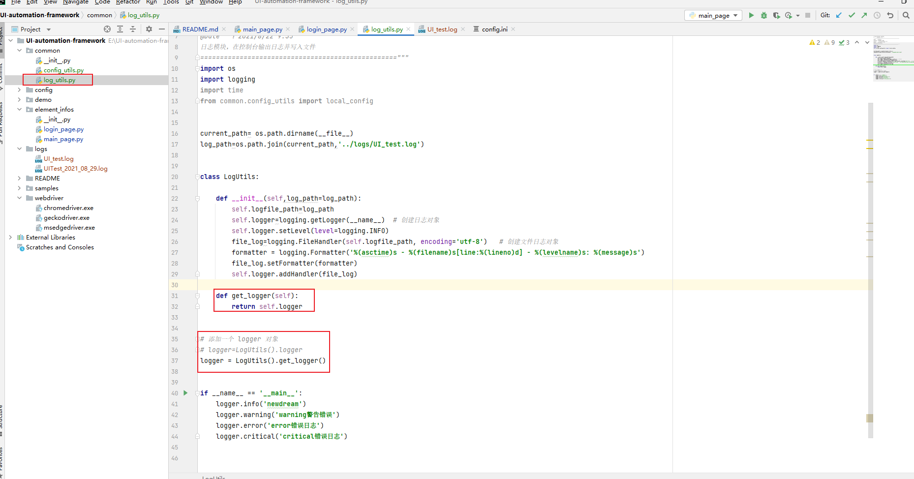
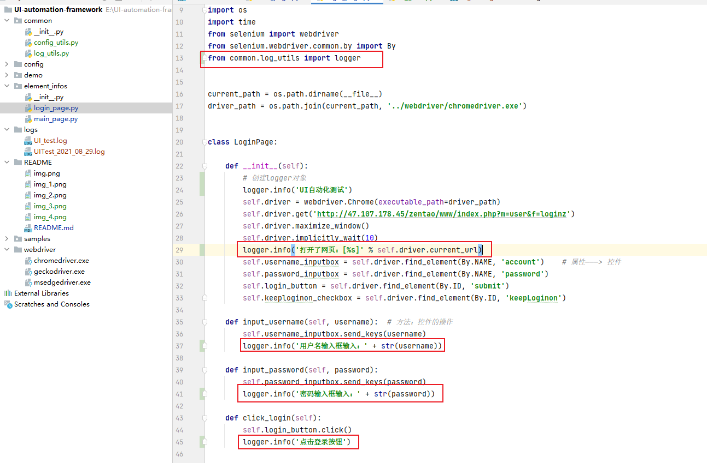

# UI-automation-framework

## UI自动化框架编写步骤及实现思路

### 一、PO设计模式基础及优化
#### 思路：
1、新建一个元素信息包element_info，存放我们的页面

2、新建login_page.py，添加属性、方法

3、新建驱动文件夹，导入驱动文件

4、新建一个main_page.py

### 二、增加日志系统
#### 1、增加了日志模块，利于bug定位

#### 2、在用例内部添加日志模块，打印操作日志

小结：
1、封装log_utils工具类
2、避免一行日志出现多行的情况，在log_utils.py添加了一个logger对象